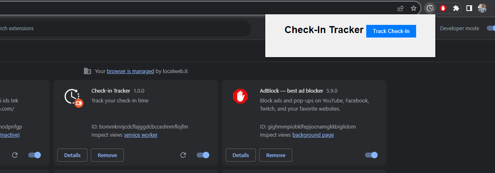
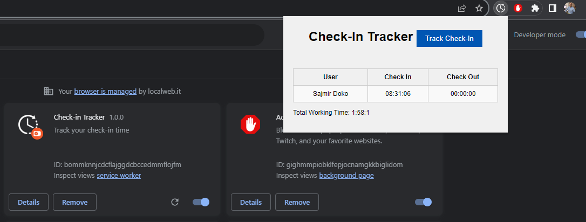

# Check-In Tracker Chrome Extension

A Google Chrome browser extension to track check-in times of employees.

## Overview

This Google Chrome browser extension allows users to track the check-in times of employees by fetching data from a specified URL. The extension displays the check-in and check-out times, calculates the total working time, and presents the data in a table format within a popup window. Additionally, it now includes an automated feature to periodically check the URL for updates and provides notifications if the total working time reaches 8 hours.

## Features

- Fetches check-in data from a specified URL.
- Calculates check-in and check-out times.
- Displays the check-in and check-out times in a popup window.
- Calculates the total working time.
- Automatically checks the URL every 5 minutes.
- Displays a notification if total working time reaches 8 hours.

## Usage

1. Clone this repository to your local machine.
2. Open Google Chrome.
3. Go to `chrome://extensions/`.
4. Enable "Developer mode" in the top right corner.
5. Click on "Load unpacked" and select the cloned repository directory.
6. Click on the extension icon to track check-ins.

## Screenshots

Here are some screenshots of the extension in action:

## Built With

- JavaScript
- HTML
- CSS

## License

This project is licensed under the [MIT License](LICENSE).
